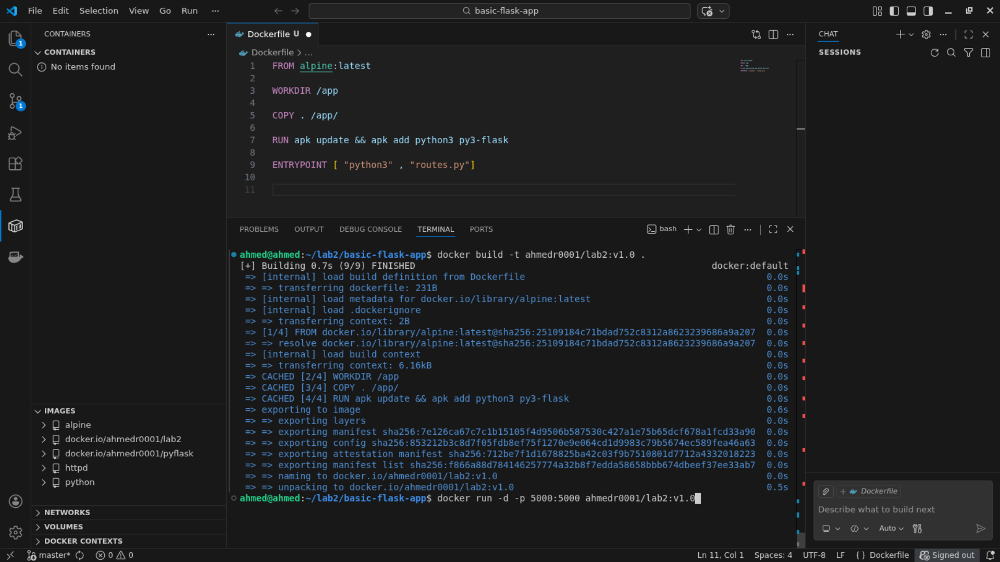
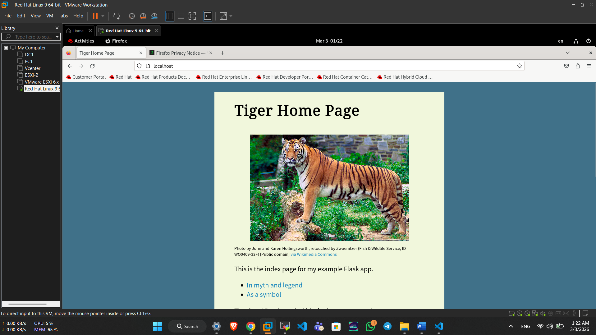

# ITI Docker Lab2: Containerizing a Flask Application

## Objective
This repository contains the configuration and application files for containerizing a basic Python Flask app using Docker. 

## Commands Used
To build the Docker image, run:
```bash
docker build -t ahmedr0001/lab2:v1.
```

To run the container and map it to host port 80 on host, run:
```bash
docker run -d -p 80:5000 ahmedr0001/lab2:v1.0
```

to push images to docker hub
```bash
docker push ahmedr0001/lab2:v1.0
```

and you can access this images using this link 
https://hub.docker.com/r/ahmedr0001/lab2

## Verification
Below are the screenshots verifying the container is running and the application is accessible on the host machine:



