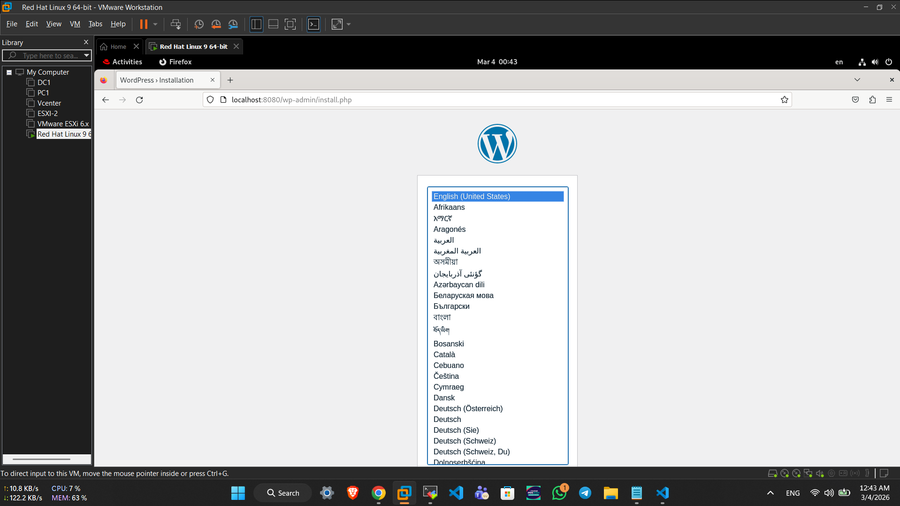

# ITI Docker Lab 3

## Objective
This repository contains the completion of Docker Lab 3 

All source files (`Dockerfile`, `docker-compose.yml`, `.env`) are included in their respective task directories within this repository.

---

## Part 1: Insecure Docker Registry & Custom Nginx Image

**Commands Used:**

Run the insecure registry container:
```bash
docker run -d -p 5000:5000 --name insecure-registry registry:latest
```

Build the custom Nginx image based on Alpine:
```bash
docker build -t localhost:5000/nginx:v1.0 .
```

Push the image to the local private registry:
```bash
docker push localhost:5000/nginx:v1.0
```

**Verification:**


---

## Part 2: WordPress and MySQL using Docker Compose

**Commands Used:**

Start the WordPress and MySQL containers in the background:
```bash
docker compose up -d
```

**Verification:**


---

## Part 3: Running Flask App from Private Registry

**Commands Used:**

Tag the existing Flask image for the local registry:
```bash
docker tag ahmedr0001/lab2:v1.0 localhost:5000/lab2:v1.0
```

Push the Flask image to the local registry:
```bash
docker push localhost:5000/lab2:v1.0
```

Start the Flask container (`Task3-pyflask`) via Docker Compose:
```bash
docker compose up -d
```

**Verification**
Below are the screenshots verifying the image push, and the final accessible application.


